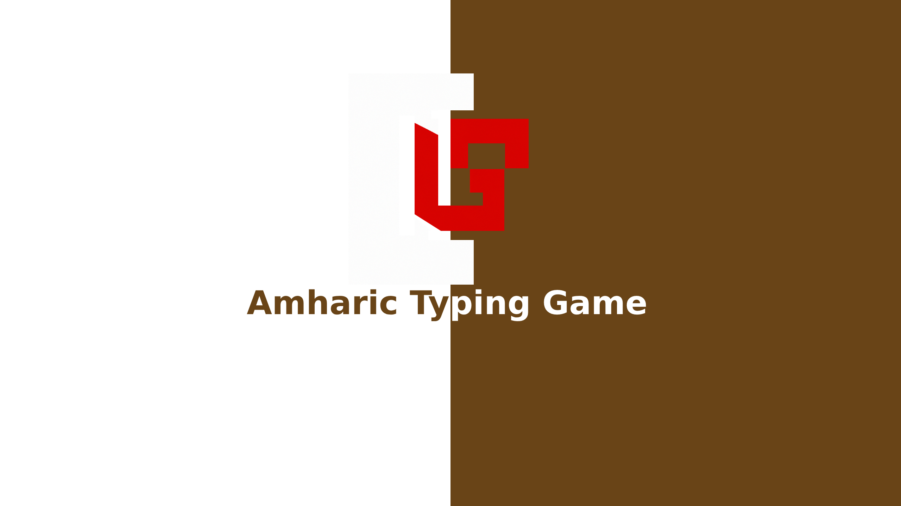

# Amharic Type Game

Welcome to Amharic Type Game, a fun and educational game that helps users improve their Amharic typing skills. This project is built with React and utilizes the SCSS framework for styling.


Features
- Engaging gameplay that challenges users to type Amharic words accurately and quickly.
- Progress tracking to monitor typing speed and accuracy improvement over time.
- Different difficulty levels to cater to users of varying typing proficiency.
- Leaderboard to compare scores with other players and compete for the top spot.
- Amharic keyboard layout and support for input methods commonly used by Amharic speakers.


## Demo

https://amharictypegame.vercel.app/

## Installation

1. Clone the repository:
```bash
   git clone https://github.com/your-username/amharic-type-game.git  

```
2. Navigate to the project directory:
```bash
   cd my-project 
```
3. Install the dependencies:
   ```bash
      npm Install
      ```
## Usage
To start the Amharic Type Game, use the following command:
```bash
    npm start
  ```
This will launch the game in your default browser, and you can start playing and improving your Amharic typing skills right away.
## Contributing

Contributions are always welcome!

See `contributing.md` for ways to get started.

Please adhere to this project's `code of conduct`.


## Authors

- [@GirumGizachew](https://www.github.com/girumgizachew1)

